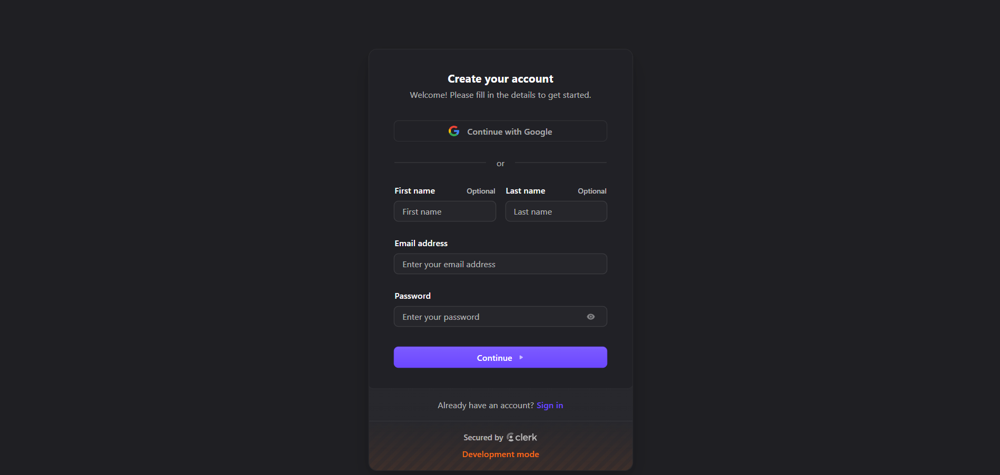
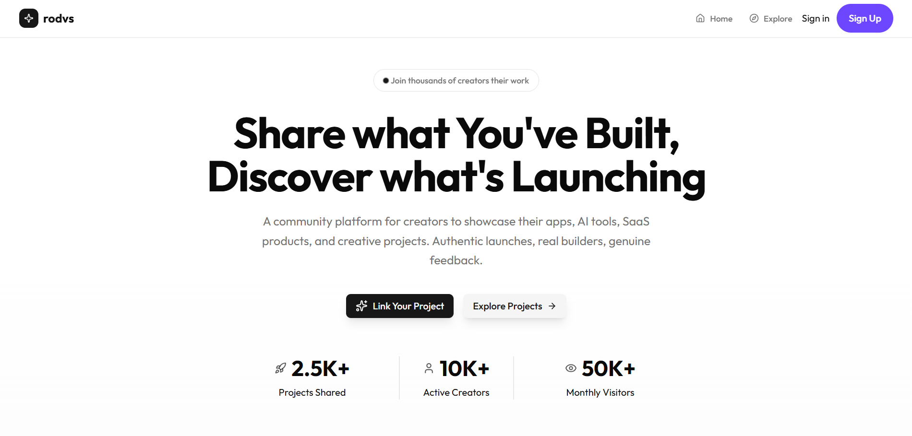
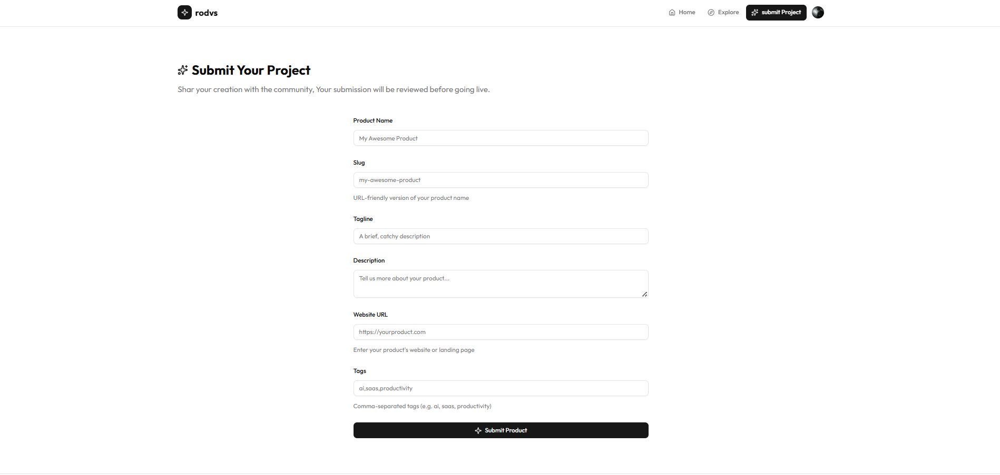
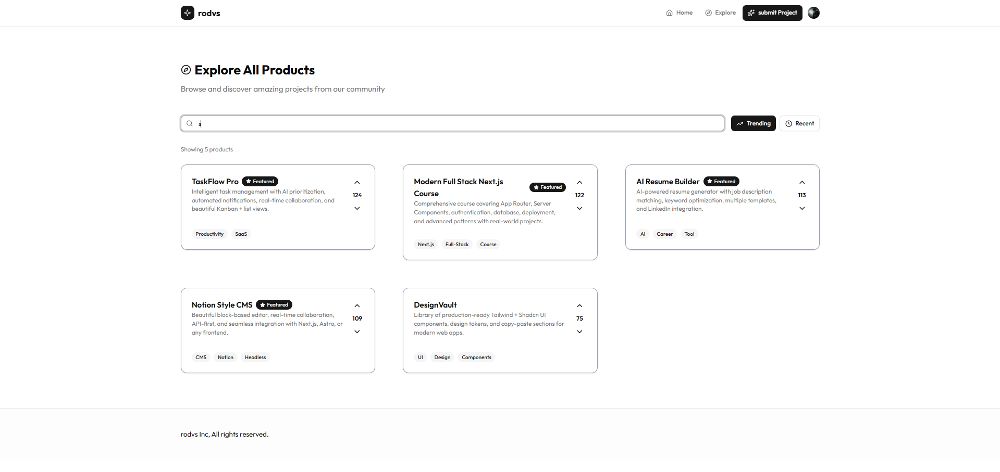

This is a modern full-stack web app built with Next.js (App Router), Drizzle ORM, Clerk authentication, and shadcn/ui components.

> ⚠️ This project is a practice project following this YouTube tutorial: https://www.youtube.com/watch?v=tI_Nt32_4wM

---

--- ## ✨ Features

- Authentication (Sign in / Sign up)
- Product / Project publishing & upload
- Search functionality
- Responsive UI
- Database persistence via Drizzle ORM
- Clean component system with shadcn/ui

--- ## 🧱 Tech Stack

- Next.js (App Router)
- TypeScript
- Drizzle ORM + PostgreSQL
- Clerk Auth
- TailwindCSS
- shadcn/ui

Create a .env.local file and add:

DATABASE_URL=
NEXT_PUBLIC_CLERK_PUBLISHABLE_KEY=
CLERK_SECRET_KEY=

### Login Page

### Home Page

### Upload Project / Product Page

### Search Page

## Deploy on Vercel

Link to see project[Vercel Platform](https://nextjs16-production-app.vercel.app/)
